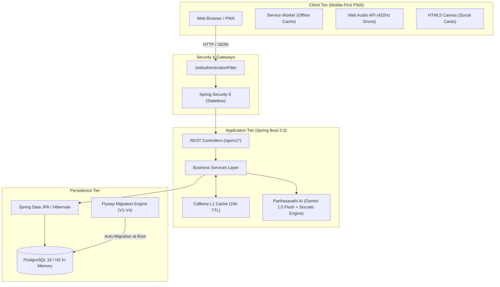

# ॐ ShlokPath (श्लोकपथ) — The Path of the Verse
**A Cloud-Ready Full-Stack Spiritual Literature Platform**  
*Built with Java 21 LTS, Spring Boot 3.3.4, Spring Data JPA, Spring Security (JWT), PostgreSQL / H2, Flyway, Caffeine Cache, Docker, and Mobile-First PWA.*

---

## Highlights & Architecture

- **Complete Canonical Scripture:** Contains all **18 Chapters** and **701 Verses** in canonical Sanskrit (Devanagari), English translation & commentary (Swami Sivananda), and Hindi translation & commentary (Swami Ramsukhdas).
- **Normalized Relational Architecture:** Replaced monolithic JSON blobs with Flyway-versioned relational tables (`chapters`, `verses`, `translations`, `explanations`, `dilemma_categories`), indexed for sub-15ms lookups.
- **Enterprise Spring Boot 3.3 Backend:**
  - **Spring Security 6 & Stateless JWT:** Token-based authentication with BCrypt hashing and role-based endpoints.
  - **Caffeine In-Memory Caching:** L1 cache layer eliminating N+1 queries and redundant database hits.
  - **OpenAPI 3 / Swagger Documentation:** Full interactive API playground at `/swagger-ui.html`.
- **Innovative Experience Features:**
  - **Prashna-Marg (Dilemma Navigator):** Filter verses by 6 psychological life dilemmas (Duty, Despair, Anger, Attachment, Fear of Death, Mind Control).
  - **Parthasarathi AI Counselor:** Contextual Socratic counselor powered by Google Gemini 1.5 Flash with fallback rule-engine resilience.
  - **Dhyana Mode (Meditation):** 432 Hz authentic Indian Tanpura drone synthesized via native Web Audio API oscillators + 4-7-8 Pranayama breathing timer.
  - **Divine Canvas:** HTML5 Canvas generator rendering 1200x1600 vertical high-resolution social quote cards for Instagram and WhatsApp.
  - **Nishkama Karma Journal:** Authenticated reflection diary tracking daily contemplation streaks.

---

## System Architecture



---

## Quick Start Guide

### Prerequisites
- **Java 21 LTS** installed (`java -version`)
- Maven (The bundled wrapper `./mvnw` is included in the `backend/` folder)
- Docker & Docker Compose (Optional, for PostgreSQL container deployment)

### 1. Run Backend Locally (Zero Configuration with In-Memory H2 DB)
The project defaults to the `dev` profile with embedded H2 and automatic Flyway migrations:

```bash
cd backend
./mvnw spring-boot:run
```
- **API Base URL:** `http://localhost:8080/api/v1`
- **Swagger UI Playground:** `http://localhost:8080/swagger-ui.html`
- **H2 In-Memory Database Console:** `http://localhost:8080/h2-console`
  - *JDBC URL:* `jdbc:h2:mem:gitadb`
  - *User:* `sa`
  - *Password:* *(leave blank)*

### 2. Run with PostgreSQL and Redis via Docker Compose
For a full production container environment:

```bash
docker compose up -d --build
```

### 3. Open the Frontend
Launch a local web server from the project root:

```bash
# Using Python
python3 -m http.server 3000

# Or using Node http-server / npx serve
npx serve -l 3000
```
Open `http://localhost:3000` in your web browser.

---

## REST API Reference

| Method | Endpoint | Description | Access |
| :--- | :--- | :--- | :--- |
| `GET` | `/api/v1/chapters` | List all 18 chapters with metadata | Public |
| `GET` | `/api/v1/chapters/{id}` | Get specific chapter details | Public |
| `GET` | `/api/v1/chapters/{id}/verses` | Paginated verses for a chapter | Public |
| `GET` | `/api/v1/verses/{chapter}/{verse}` | Verse with Sanskrit, translations & commentaries | Public |
| `GET` | `/api/v1/verses/search?q={query}` | Full-text search across all 701 verses | Public |
| `GET` | `/api/v1/dilemmas` | List 6 life dilemma categories with prescriptions | Public |
| `GET` | `/api/v1/dilemmas/{category}/verses`| Get verses mapped to a dilemma | Public |
| `POST` | `/api/v1/advisor/consult` | Consult Parthasarathi AI Advisor | Public |
| `POST` | `/api/v1/auth/register` | Register new user account | Public |
| `POST` | `/api/v1/auth/login` | Authenticate user & receive JWT token | Public |
| `GET` | `/api/v1/journal` | Retrieve user reflection entries and streak | Authenticated |
| `POST` | `/api/v1/journal` | Save reflection journal entry | Authenticated |

---

## Testing & Verification

The backend includes a comprehensive automated test suite with **13+ tests** covering services, controllers, authentication, and full database initialization.

```bash
cd backend
./mvnw test
```

### Test Highlights:
- **`GitaApplicationTests`:** Full `@SpringBootTest` asserting database startup, Flyway V1–V4 migrations execution, and persistence of all 18 chapters and 701 verses.
- **`VerseServiceTest`:** Mockito unit tests verifying Caffeine cache hits, verse lookups, and exception handling.
- **`DilemmaServiceTest`:** Verifies category retrieval and mapped verse queries.
- **`AuthServiceTest`:** Tests user registration, password hashing with BCrypt, JWT generation, and duplicate account rejection.
- **`ChapterControllerTest` & `DilemmaControllerTest`:** MockMvc controller tests validating REST contracts, HTTP status codes, and JSON responses.

---

## Project Directory Structure

```text
├── backend/
│   ├── src/main/java/com/bhagavadgita/api/
│   │   ├── config/          # SecurityConfig, JwtService, CacheConfig, OpenApiConfig
│   │   ├── controller/      # Chapter, Verse, Dilemma, AI, Journal, Auth controllers
│   │   ├── entity/          # JPA Entities (Chapter, Verse, Translation, Explanation, etc.)
│   │   ├── repository/      # Spring Data JPA repositories with JPQL queries
│   │   ├── service/         # Business logic layer with Caffeine cache & AI advisor
│   │   └── dto/             # Request & Response records / DTOs
│   ├── src/main/resources/
│   │   ├── db/migration/    # Flyway SQL migrations (V1 schema, V2 chapters, V3 verses, V4 dilemmas)
│   │   └── application.yml  # Dev (H2) and Prod (PostgreSQL) configurations
│   ├── src/test/java/       # JUnit 5 & Mockito test suite
│   ├── Dockerfile           # Multi-stage container build
│   └── mvnw                 # Maven wrapper
├── css/
│   ├── main.css             # Base styles, typography, and 2 master themes
│   └── features.css         # Feature styles (Dhyana, AI dialog, Canvas, Dilemmas)
├── js/
│   ├── api-client.js        # Hybrid REST client (Spring Boot API + fallback)
│   ├── dhyana-audio.js      # Web Audio API 432 Hz Tanpura synthesizer
│   ├── canvas-card.js       # HTML5 Canvas 1200x1600 quote card generator
│   └── app.js               # Application coordinator & event bindings
├── data/
│   └── chapters/            # Partitioned chapter JSON files for lightweight client caching
├── icons/                   # High-res PWA and app icons
├── docker-compose.yml       # Multi-container orchestration (Backend + Postgres + Redis)
├── index.html               # Main PWA application shell
├── service-worker.js        # Service Worker for offline capability
└── RESUME_GUIDE.md          # Complete Java Full Stack Developer resume & interview guide
```

---

## Resume & Interview Preparation

Are you adding this project to your software engineering resume?  
Check out [`RESUME_GUIDE.md`](./RESUME_GUIDE.md) for:
- ATS-optimized bullet points formatted using the Google XYZ framework.
- System design deep-dive answers (N+1 query elimination, Caffeine caching, Flyway migrations, stateless JWT security, circuit-breaker AI fallback).
- Interview cheat sheet and talking points.

---

## License
This project is open-source and available under the [MIT License](LICENSE).
